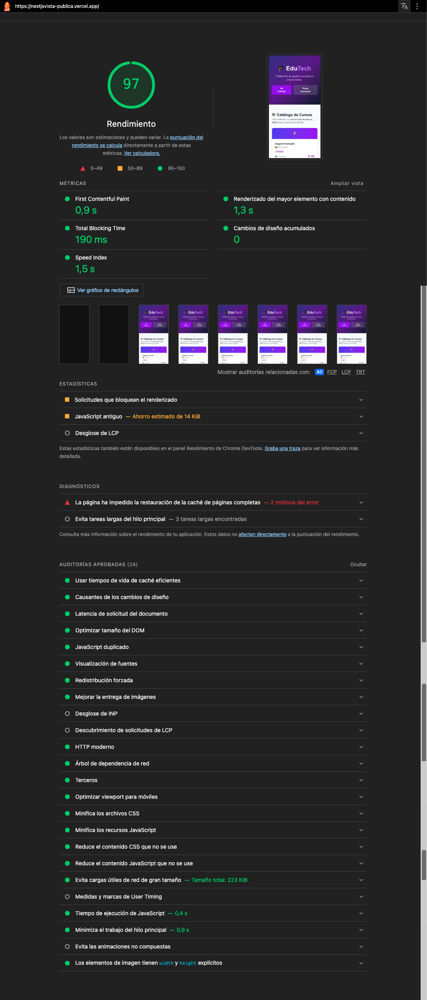
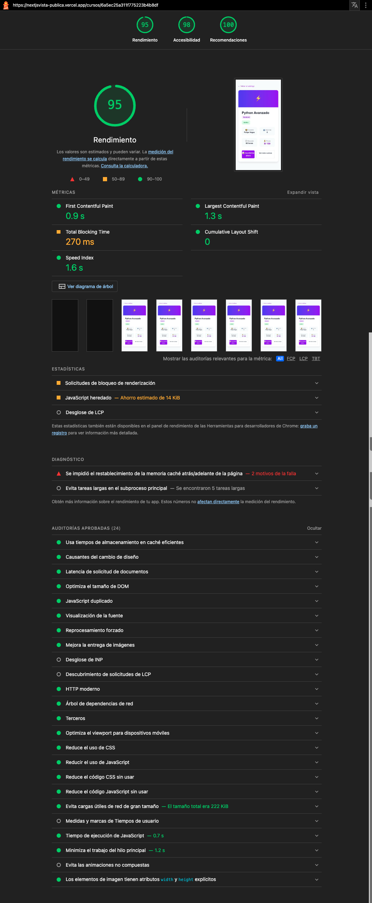
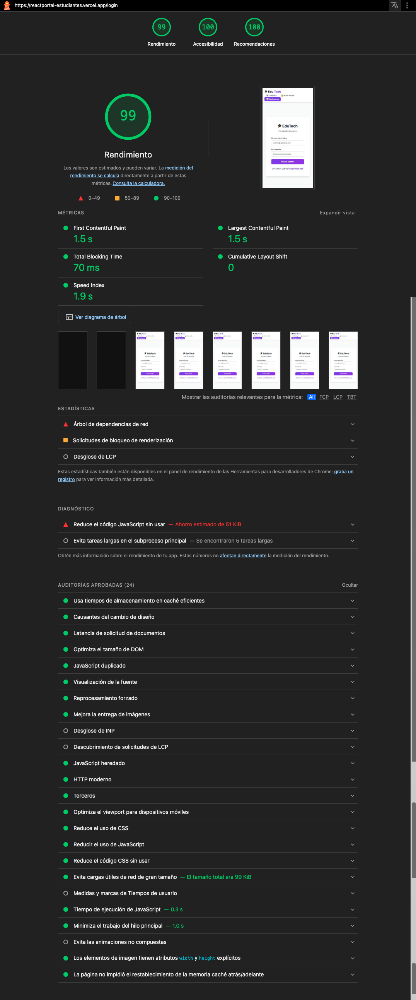
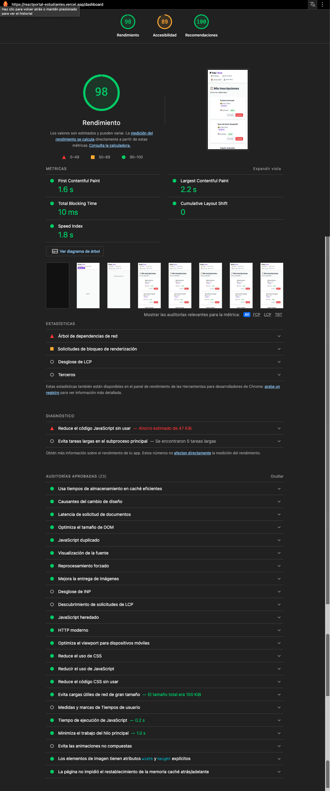
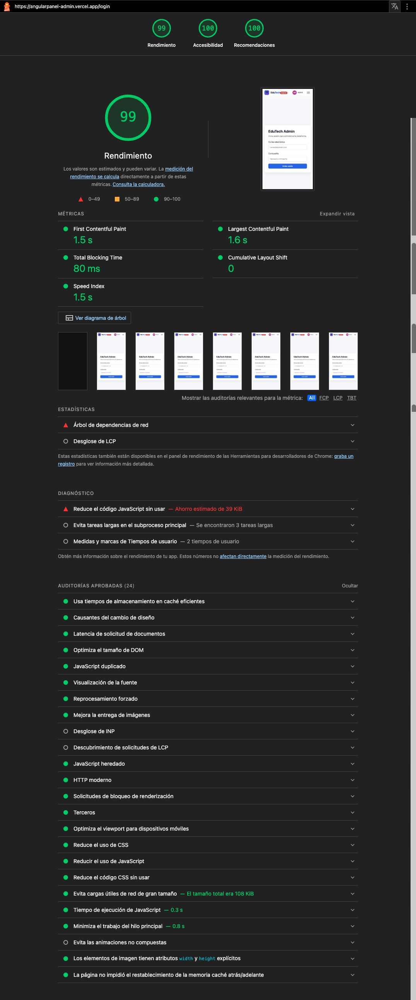
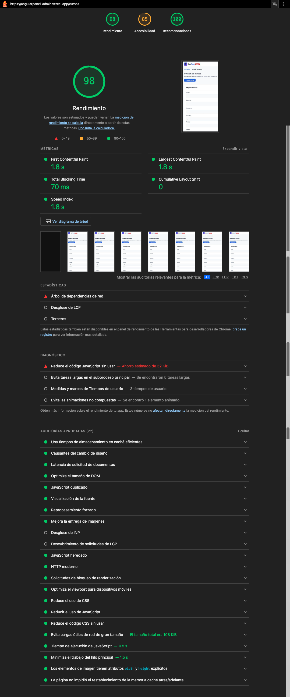

# Auditoría de Calidad — Lighthouse

Auditoría realizada sobre la aplicación pública (**Next.js — Vista Pública**), en ventana de incógnito y contra las URLs de producción desplegadas en Vercel/Render.

## 🚀 URLs Desplegadas

| Servicio         | Local                     | Producción | Public URL                                                                                        |
| ---------------- | ------------------------- | ----------- | ------------------------------------------------------------------------------------------------- |
| Next.js Público | `http://localhost:3001` | Vercel      | [nextjsvista-publica.vercel.app](https://nextjsvista-publica.vercel.app/)                          |
| React Estudiante | `http://localhost:5173` | Vercel      | [reactportal-estudiantes.vercel.app/catalogo](https://reactportal-estudiantes.vercel.app/catalogo) |
| Angular Admin    | `http://localhost:4200` | Vercel      | [angularpanel-admin.vercel.app](https://angularpanel-admin.vercel.app/login)                       |

---

## 📄 Páginas auditadas

| #   | Página                     | URL                                                      |
| --- | --------------------------- | -------------------------------------------------------- |
| 1.1 | Catálogo público (home)   | `https://nextjsvista-publica.vercel.app/`              |
| 1.2 | Detalle curso               | `https://nextjsvista-publica.vercel.app/cursos/[id]`   |
| 2.1 | Portal Estudiante (login)   | `https://reactportal-estudiantes.vercel.app/login`     |
| 2.2 | Mis inscripciones           | `https://reactportal-estudiantes.vercel.app/dashboard` |
| 3.1 | Panel Administrador (login) | `https://angularpanel-admin.vercel.app/login`          |
| 3.2 | Gestión de cursos          | `https://angularpanel-admin.vercel.app/cursos`         |

---

## 📱Reporte 1.1 — Catálogo público (home)

| Rendimiento | Accesibilidad | Recomendaciones |
| :---------: | :-----------: | :-------------: |
|  97 / 100  |   98 / 100   |    100 / 100    |

---

## 📱 Reporte 1.2 — Detalle de curso

| Rendimiento | Accesibilidad | Recomendaciones |
| :---------: | :-----------: | :-------------: |
|  95 / 100  |   98 / 100   |    100 / 100    |

---

## 📱 Reporte 2.1 — Portal Estudiante (login)

| Rendimiento | Accesibilidad | Recomendaciones |
| :---------: | :-----------: | :-------------: |
|  99 / 100  |   100 / 100   |    100 / 100    |

---

## 📱 Reporte 2.2 — Mis inscripciones

| Rendimiento | Accesibilidad | Recomendaciones |
| :---------: | :-----------: | :-------------: |
|  98 / 100  |   89 / 100   |    100 / 100    |

---

## 📱 Reporte 3.1 — Panel Administrador (login)

| Rendimiento | Accesibilidad | Recomendaciones |
| :---------: | :-----------: | :-------------: |
|  99 / 100  |   100 / 100   |    100 / 100    |

---

## 📱 Reporte 3.2 — Gestión de cursos

| Rendimiento | Accesibilidad | Recomendaciones |
| :---------: | :-----------: | :-------------: |
|  98 / 100  |   85 / 100   |    100 / 100    |

---

## 🔍 Análisis de resultados

- **Rendimiento:** todas las páginas ≥95/100.
- **Accessibilidad:** En Gestión de cursos (85) y Mis inscripciones (89) bajan por contraste de color en badges de estado y labels de formulario. El resto está en 98-100.
- **Recomendaciones:** 100/100 en las 6 páginas — sin errores de consola ni vulnerabilidades detectadas.

## 🛠️ Mejoras aplicadas

1. Speed Index del catálogo público: de 9.7 s a 1.5 s — se corrigió el renderizado en dos pasos (shell vacío → datos) que hacía "parpadear" la página tras el SSR.
2. Imágenes sin saltos de layout: width/height explícitos en todas las páginas → Cumulative Layout Shift = 0 en las 6.

## 🔗 Referencias

- [`arquitectura.md`](./arquitectura.md) — stack y SSR de `frontend-nextjs`.
- [`api-endpoints.md`](./api-endpoints.md) — endpoints de `/api/cursos`.
- [`seguridad.md`](./seguridad.md) - checklist de seguridad
